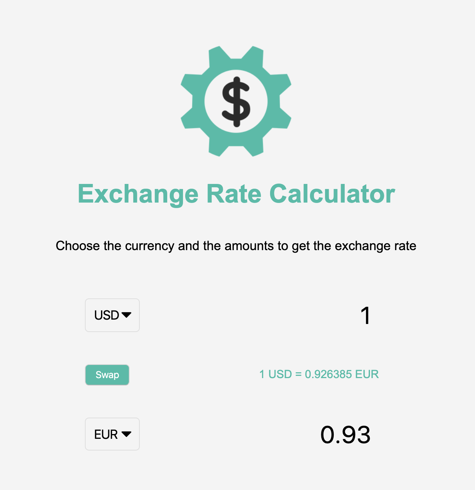
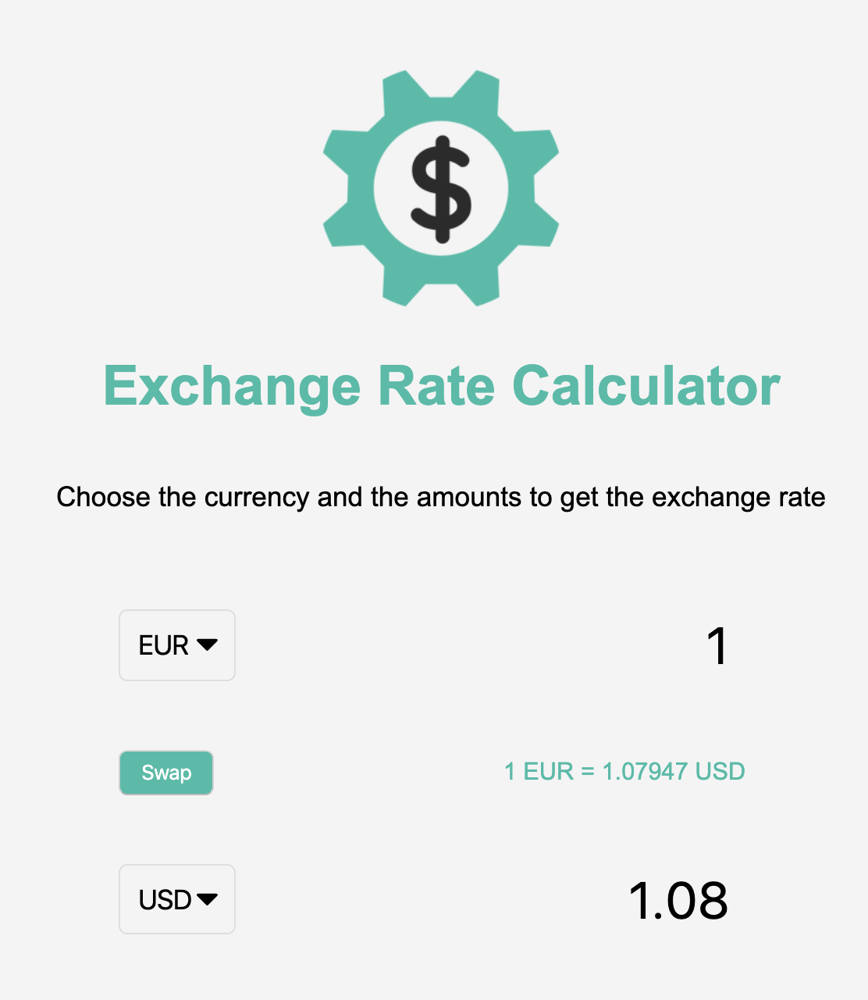

# Exchange Rate

This project follows along with the [20 Web Projects With Vanilla JavaScript](https://www.udemy.com/course/web-projects-with-vanilla-javascript/) tutorials by Brad Traversy.

This project creates a program that allows the user to find out the exchange rate between two current forms of currency. A swap button will let the user switch the two chosen forms of currency, such as USD to EUR being changed to EUR to USD, as shown in the photos below.

This project uses JavaScript, HTML, and CSS. The exchange rate information is accessed via API.

